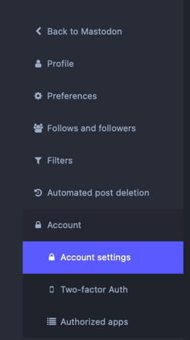
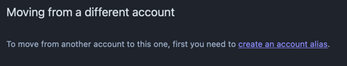
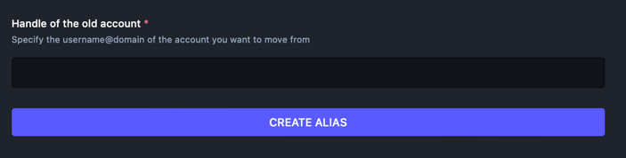
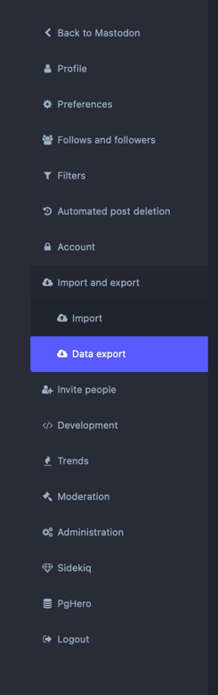
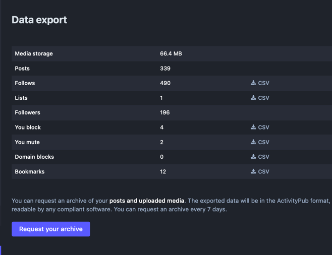
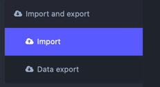

So you made the decision to jump from Twitter to Mastodon, and you thought you chose the right instance, but you were mistaken or found one that suits you better. But you want to keep your followers and followers intact. Mastodon has got a way of doing it built right into it.

## Setup your New Account

Once you have created and logged into your account, open preferences, then select Account and then Account settings.

In the middle of the screen, There will be an option for Moving from a different account. Click on create an account alias.

Once this has been completed, change to your new instance.

## Exporting your Data

Later on we will move you followers over, but Mastodon does not move the rest of your data. However, it does allow for you to download this data in a CSV format that you can then Import into your new Instance

The data that we will be able to export is:

* Follows,
* Lists,
* Block List,
* Mute List,
* Domain Blocks, and
* Bookmarks.

To download the csv archive, simply click on the Link to the right that has an arrow pointing into a filing tray with the word CSV on it.

If you wish, you can also download a full archive of your account, but currently this can not be imported back into your new instance.

## Creating the move job

From here you will look for the link under Move to a different account.

You will now be presented with the Account migration screen, this is where you will move your followers over and then redirect your account.

Put the Handle of your new account in the format as username@neurodiversity-in.au

Put the password for your old account into the password box and click move followers.

## Importing your data.

From the import section select the type of data you are importing, under Data click choose file and choose the matching file you dowloaded earlier.

Select Merge and hit upload. Repeat this for all remaining files.

Currently, there is no native support to import lists, but 3rd party tools have been made available to correct this issue until it is implemented