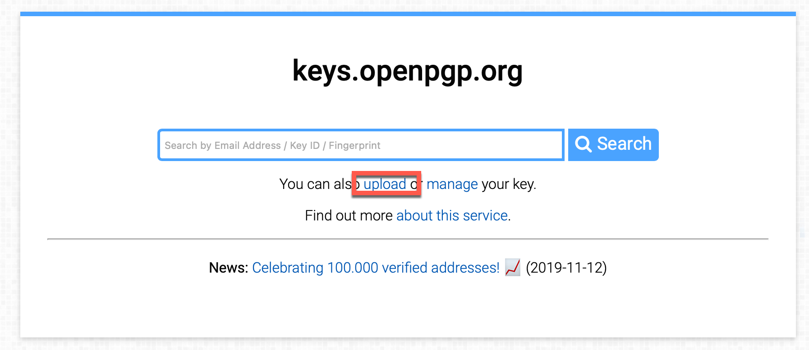
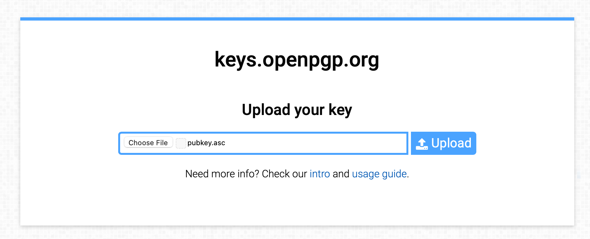
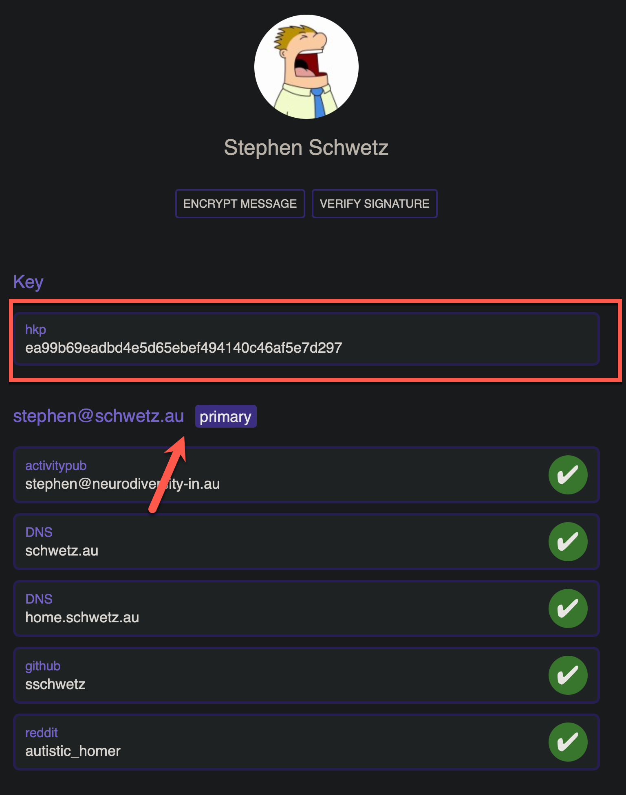
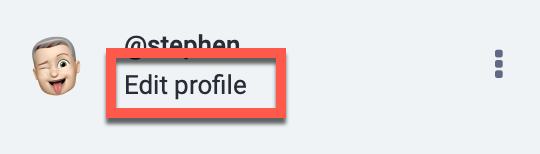
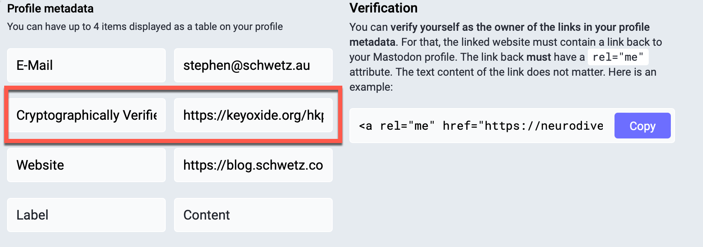

This option of identity verification is not as widely used, as it is more technical and required advanced toolsets.


> Keyoxide allows the linking online properties together. To ensure it happens in a trustworthy manner, Keyoxide uses an open source, decentralised and cryptography-based approach to bidirectional linking.


To use Keyoxide you need to create a PGP keypair. In this example I will be using gpgtools for Mac, but other tools are available for most other OSs.


The process needed to allow verification is pretty simple


1. Create a gpg key pair;
2. Add Ariadne Identity metadata to the key;
3. Upload the key to OpenPGP.org and verify the key via the key's email address;
4. Add the Keyoxide  link to your Mastodon profile.


## Create the GPG Keypair.


You create a GPG keypair using the gpg2 command from either GnuPG or PGPTools. Launch gpg2 and follow the prompts to cenerate the heys


```
gpg2 --full-generate-key
```


Once you have generated they keys you need to list your secret keys to find the one that you have just created.


```
gpg2 --full-generate-key
```


The output will show all of the keys that are currently available, locate the key that you want to use for Mastodon, and copy the long alphanumerical string the corresponds to it in this case I only have one key and the my key's fingerprint is: **EA99B69EADBD4E5D65EBEF494140C46AF5E7D297**


```bash
gpg2 --full-generate-key
/Users/stephen/.gnupg/pubring.kbx
---------------------------------
sec   rsa4096 2021-11-17 [C] [expires: 2024-12-10]
      EA99B69EADBD4E5D65EBEF494140C46AF5E7D297
uid           [ultimate] Stephen Schwetz <stephen@schwetz.au>
uid           [ultimate] Stephen James Schwetz <sschwetz@gmail.com>
uid           [ultimate] Stephen James SChwetz <sschwetz@hotmail.com>
uid           [ultimate] Stephen James Schwetz <sschwetz@yahoo.com.au>
uid           [ultimate] Stephen Schwetz <stephen.schwetz@icloud.com>
uid           [ultimate] Stephen Schwetz <schwetzy@icloud.com>
uid           [ultimate] Stephen Schwetz <stephen@schwetz.com.au>
uid           [ultimate] Stephen Schwetz <stephen@schwetz.id.au>
uid           [ultimate] Stephen Schwetz <stephen@dot.id.au>
ssb   rsa4096 2021-11-17 [S] [expires: 2024-10-30]
ssb   rsa4096 2021-11-17 [E] [expires: 2024-10-30]
ssb   rsa4096 2021-11-17 [A] [expires: 2024-10-30]
```


Now that we have the key we can add the required metadata to allow keyoxide to perform verification.


```
gpg2 --edit-key EA99B69EADBD4E5D65EBEF494140C46AF5E7D297
```


At the gpg2 prompt select the required the user id (the Key Owners name and email address and set the UID as primary in my case it will be my email address stephen@schwetz.au and is UID 1


```
gpg> uid 1
gpg> primary
```


## Adding Aradine Metadata.


Keyoxide uses Ariadne metadata to allow it to recognise your Mastodon identity. The added metadata must start with  proof@ariadne.id= and be followed by the URL of you Mastodon profile page I will be using mine [https://neurodiversity-in.au/@Stephen](https://web.archive.org/web/20230306174006/https://neurodiversity-in.au/@Stephen)


```
gpg> notation
proof@ariadne.id=https://neurodiversity-in.au/@Stephen 
gpg> save
```


## Export your Key and Upload to keys.openpgp.org.


The public key and its metadata needs to be extracted from your keyring and uploaded to keys.opengpg.org keyserver.


```
gpg2 --armor --export EA99B69EADBD4E5D65EBEF494140C46AF5E7D297 > pubkey.asc
```


The public key  now needs to be added to the uploaded onto the openpgp.org keyserver.


If you are using GnuPG do not attempt to use —send-keys to upload the keys, as it strips out the metadata


Browse to [https://keys.openpgp.org](https://web.archive.org/web/20230306174006/https://keys.openpgp.org/) and select upload





You will then be presented with the upload screen, select the pubkey.asc file that was created earlier


[Screenshot of keys.opengpg.org](https://web.archive.org/web/20230306174006/https://kb.neurodiversity-in.au/uploads/images/gallery/2022-12/O8FIHtiGc064oVOS-image.png)


Once completed click on upload





If the certificate has been changed you will need to send the verification email to each account and click on the link inside the email. Once this has been completed the key will be ready to be verified with Keyoxide.


## Testing Keyoxide


To test browse to the url [https://keyoxide.org/hkp/](https://web.archive.org/web/20230306174006/https://keyoxide.org/hkp/) and then the fingerprint of your certificate in my case the url would be [https://keyoxide.org/hkp/EA99B69EADBD4E5D65EBEF494140C46AF5E7D297](https://web.archive.org/web/20230306174006/https://keyoxide.org/hkp/EA99B69EADBD4E5D65EBEF494140C46AF5E7D297). You should see the site display the key and your primary email address.





## Linking Mastodon and Keyoxide.





To add the signature, edit your profile; this can be done by clicking edit profile next to your avatar above the toot composition box. Inside the profile, scroll  down to the Profile metadata and the fill in the first field with a description, I chose to use Cryptographically Verified. for the URL you need to put the url that you tested above, mine is: ([https://keyoxide.org/hkp/EA99B69EADBD4E5D65EBEF494140C46AF5E7D297](https://web.archive.org/web/20230306174006/https://keyoxide.org/hkp/EA99B69EADBD4E5D65EBEF494140C46AF5E7D297))


