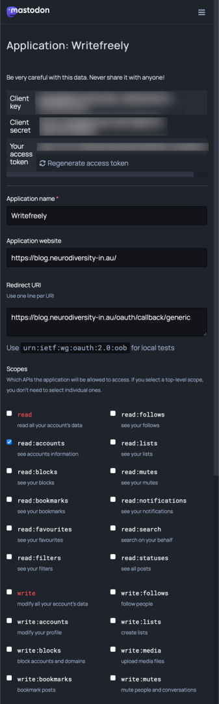

One of the things that I try to do with the neurodivergent community is to have them learn to self-advocate. One way that I have found helpful is to write blog posts; some are rather boring, and not all of mine are about self-advocacy. But just as journaling is used within the mental health profession to allow you to go back later and look at a set period, blogs have led me to go back and show what piqued my interest.

I used to use WordPress, but one of my children decided she wanted to start blogging but did not want to use my WordPress site; she wanted her independent blog. As I was interested in the fediverse, I searched for blog products supporting ActivityPub and settled on writefreely.

As I had a #Mastodon instance, I decided that I could use the same domain as the Mastodon site, so I set up writefreely on this domain. At the time, it might be helpful to others from the community and set it up to allow anyone to set up a blog. However, I spent more time silencing spam blogs than I got time to write myself. There had to be a better way.

I noticed that the writefreely blog has options to use generic OAuth. I knew that Mastodon supported being an OAuth endpoint, so I could use Mastodon to authenticate my users. Thus, spammers would be less likely to be able to set up blogs as it require email addresses and other things that put it into the too-hard basket.

## Setting up Mastodon

The first thing that you need is a Mastodon Instance that you have access to the Developer Tab in preferences. From there, you will need to create a new application. Fill out the following settings:

**Application Name:**  Writefreely **Application Website:** [https://the.base.url.of.writefreely/](https://the.base.url.of.writefreely/) 

**Redirect URL:** [https://the.base.url.of.writefreely/oauth/callback/generic](https://the.base.url.of.writefreely/oauth/callback/generic) 

**Scopes:** read:accounts (ensure that you remove read, write, AND follow from the scope, as we want the minimum permissions.

Click on Submit at the bottom of the screen, and then you should be presented with your application; click to open the application details you should see a screen like below.




Make a note of the Client Key and Client Secret, as we will be using them shortly

## Configuring writefreely

To configure writefreely, you need to be able to edit the config.ini file; this can be over ssh, console, sftp use one that your host supports.

At the bottom of the file, you should locate the oauth.generic config block. Edit it to match the below block

```
[oauth.generic]
client_id          = <Client ID From Above>
client_secret      = <Client Secret From Above>
host               = https://your.mastodon.url
display_name       = Login with Mastodon (this can be edited to be whatever you please)
callback_proxy     = 
callback_proxy_api =
token_endpoint     = /oauth/token
inspect_endpoint   = /api/v1/accounts/verify_credentials
auth_endpoint      = /oauth/authorize
scope              = read:accounts
allow_disconnect   = false
map_user_id        = id
map_username       = username
map_display_name   = display_name
map_email          =
grant_type         = authorization_code
```

Once you have saved this and restarted writefreely, you can authenticate with your Mastodon Account. If you already have a blog in account settings, you will be able to link your Mastodon account without having to do a backup/restore.
