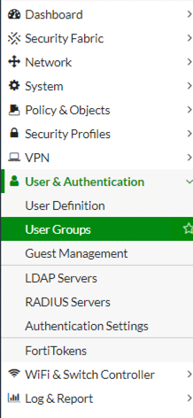

---
#**************************************
lang: en-AU
layout: post
social-share: true
category: kb

typora-copy-images-to: ../assets/img/${filename}
typora-root-url: ../
#**************************************

#*************************************
#fill this if you have renamed the page
redirect_from:
  - 2022/05/04/creating-users-and-groups-on-fortigates.html
  - 2022-05-04-creating-users-and-groups-on-fortigates
  - 2022-05-04-creating-users-and-groups-on-fortigates/
  - 2022-05-04-creating-users-and-groups-on-fortigates/index.html
#*************************************

title: KB0010
subtitle: Set Up Users and Groups on Fortigate Firewalls
author: stephen
updated: 
cover-img: 
thumbnail-img: 
full-width: false

share-title: Set Up Users and Groups on Fortigate Firewalls
share-description: For the secure functioning of a Fortigate Firewall, it is recommended to only permit access to the functions of the Fortigate that a user needs to have access to. 
share-img: 

tags:
  - fortios
  - fortigate
  - firewall

categories: kb
comments: true

---

For the secure functioning of a Fortigate Firewall, it is recommended to only permit access to the functions of the Fortigate that a user needs to have access to. Some of the functions that utilise these groups with a FortiGate are:

* Administration of the Fortigate (Operations and Engineering)
* Troubleshooting of the Fortigate (Service Desk)
* SSL-VPN 
* Explicit Web Proxy
* IP Policies.

## Authentication Methods On Fortigates

Before setting up authentication you will need to decide how you want your users to be able to authenticate. Fortigate’s support for authentication comprises:

* either local accounts, 
* [Fortinet FortiAuthenticator](https://www.fortinet.com/products/identity-access-management/fortiauthenticator) (FSSO)
* Radius (RSSO) 

Radius is an industry-standard, and there are multiple products available:

* [Radiator](https://www.open.com.au/radiator/)
* Microsoft NPS (Part of Windows Server)
* [Aruba Clearpass](https://www.arubanetworks.com/en-au/products/security/network-access-control/secure-access/)

This is not a definitive list, and none of them may be suitable for your environment, but industry standards are

Most larger enterprises will have some style of Single Sign On (SSO), as this allows their users to use their current credentials across a large suite of products. This can be utilised by Fortigate to allow the enterprise to also enforce password lockout policy and password strength. It also allows them to log security details

Due to the simplicity of setup and lack of infrastructure, most smaller sites will utilise local accounts. The drawback is that the login details may differ from the user’s standard account, and there is no central logging.

## Creating Groups On Fortigates

Standard security is that you create a group to for the function that you wish to protect, assign your users to the new group and then use the group that you have created to secure the required role /policy

To Administer groups from the lefthand navigation menu select **Users & Authentication -> User Groups.** I prefer to create my groups first and then add my users to the group. You can also create the user first and then add them to the group, it’s a personal preference. If you are utilising Radius you need to create a local group and then link it through the UI to the group returned from your authentication/ accounting Field.

The next step is to give the group a name, this is a free text field, so be descriptive, so that it will help others know its purpose.

The type is one of the following:

* Firewall – Local Authentication
* FSSO – FortiAuthenticator
* Radius

As we have not yet created any users leave the Members field empty. As we are not using Radius in this example leave the remote group blank. Click on OK to save the group

## Creating Users On Fortigates

In this example, we will be utilising local authentication, as it is simpler and not everyone has access to either FSSO or RSSO.

Access to the User/Groups Creation Wizard is located at **User & Authentication -> User Definition** on the left-hand navigation bar 

As we are creating a local user select the user type as a local user.

You will next be prompted to enter the username and password for the account that you wish to create. 

Once you have done this click on the Next Button.

The next screen is where you would configure Two-factor Authentication (2FA).This is outside of the scope of this example.

So just click Next.

We are now at the Extra Info page. This page allows you to create the user enabled/disabled. It will also allow you to specify User Groups that this user is associated with.

To assign User Groups enable the option if disabled and then click on the + symbol to add User Groups.

This will open a sidebar on the right-hand side of the screen, from this you can select one or more User Groups.

If you need to remove a User Group, simply click on it a second time.

Once completed selecting groups, click close to return to the wizard.

You should now see the User Group field showing the users that you have selected.

Click submit to have the Fortigate create the user

You should now see that the user you have created is populated into the local users.

You should now see that the user you have created is populated into the local users.

## Wrapping up

Setting up your user account and groups may be seen as one of the basic portions of administering a Fortigate. However, if you take the time and effort now to set up your users and groups the payback will be reciprocated by your fellow Fortigate admins when they have to enable a new function of the Fortigate or permit a user to have access to a network segment. SSL-VPN relies highly on groups etc to allow users to only access the resources required for the end-user to perform their job functions.
