There will be times within the NSX lifecycle when you could be required to deploy a new edge node, including:

* The edge node has become cpu constrained;
* The NSX environment needs to have additional throughput, and you are already running large edge nodes; or
* The edge node has become corrupted and needs to be replaced to restore service.

## TLDR - Here is a Video

<video src="/assets/Video/Deploy%20a%20New%20NSX-T%20Edge%20Node.mp4"></video>

## Step-By-Step Guide

1. Log in to the NSX manager; the global or local manager is suitable. If you are using the global manager, you must select the local manager for the environment to which you will add the edge node.
1. From the NSX manager screen select `System` from the top menu bar.

1. From the left hand menu click on `Fabric`.

   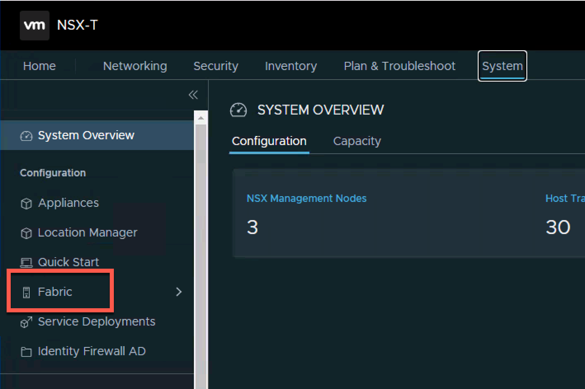

1. From the menu that has extended from below the Fabric option select `Nodes`.

   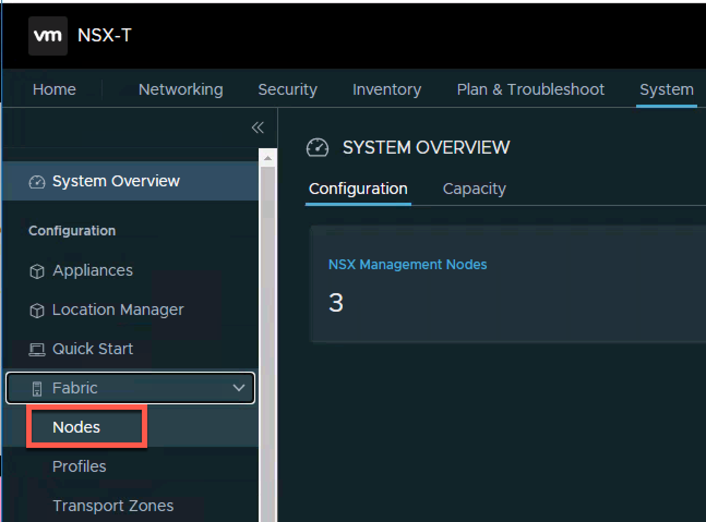

1. Select `Edge Transport Nodes` from the secondary menu that has appeared on the right.

   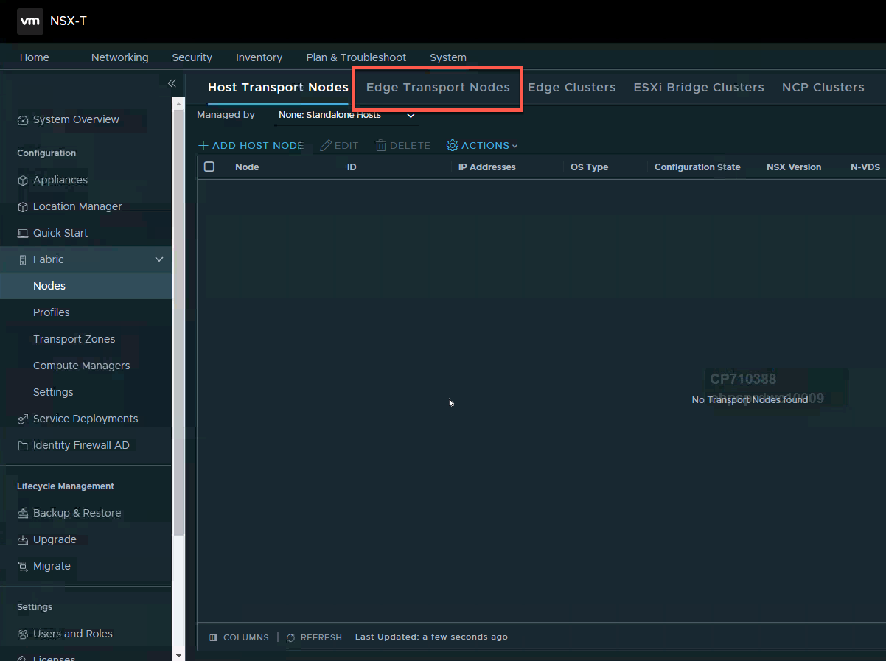

1. Select `+ Add Edge Node` from the action menu.

   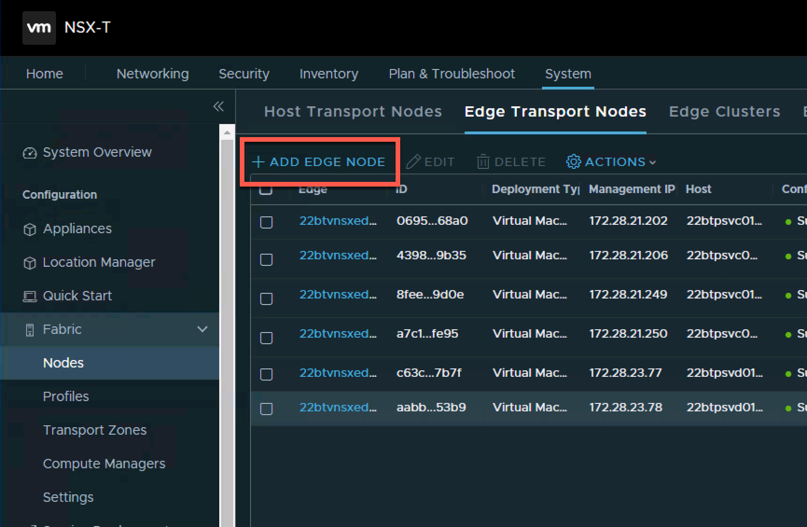

1. You will then be presented with the `Add Edge Node` wizard

   * Fill out the name of the node, this will be how it is displayed in the UI
   * Fill out the FQDN[^fn1]
   * Select the Form factor for the node. [^fn2]
   * Do not use Small unless it it for a lab environment
   * Then click next

   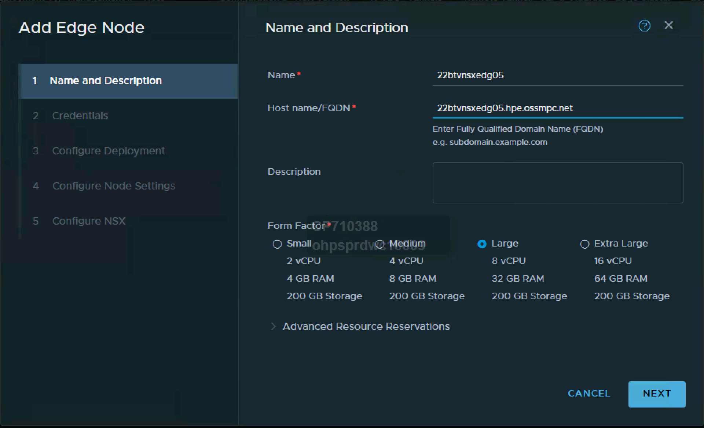

1. Fill in the User

   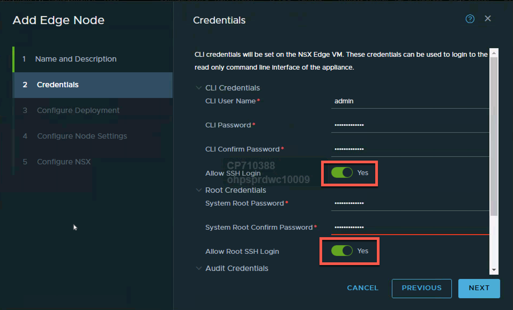

   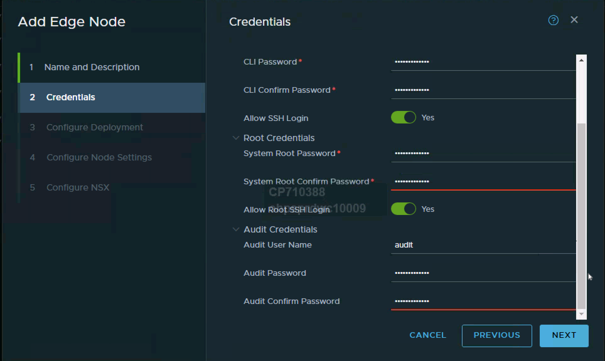

1. test

   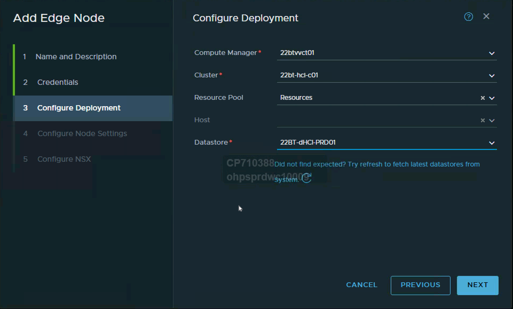

1.  test

    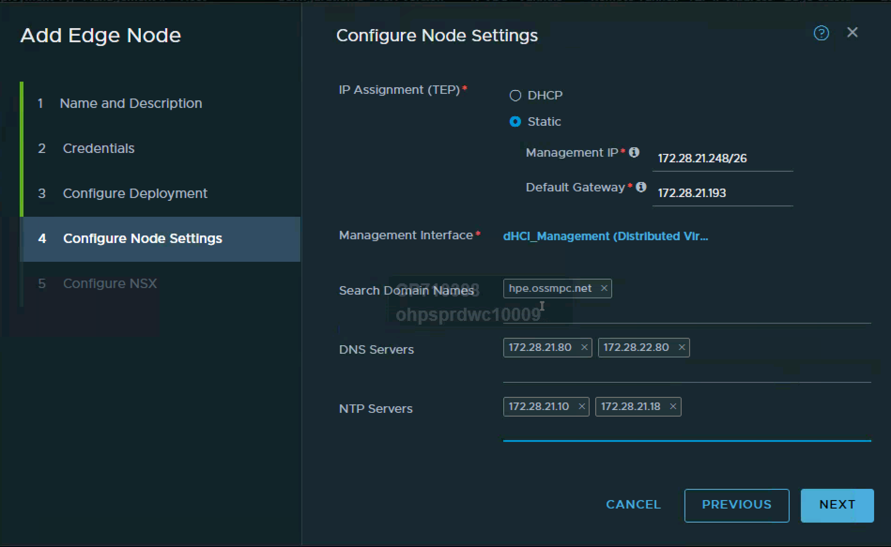

1.   test

     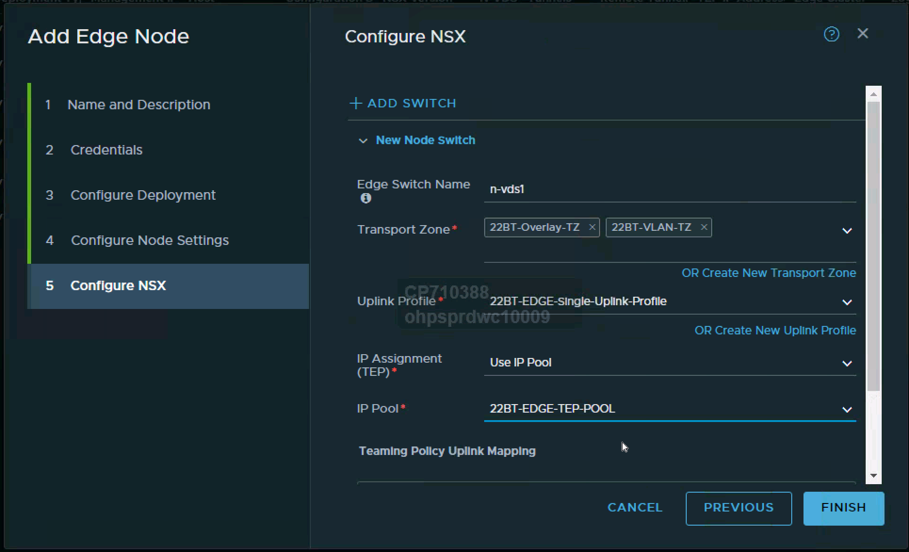

1.  test

   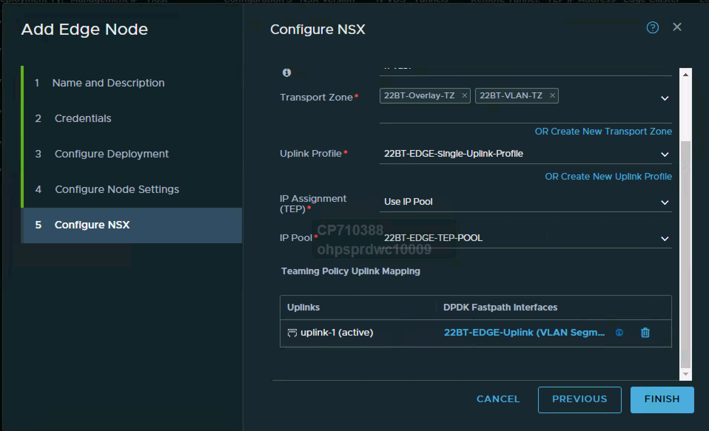

1.  test

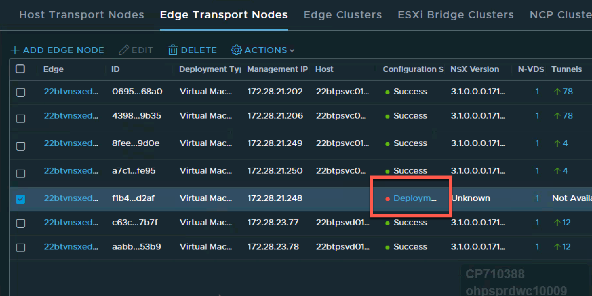

1.  test

1. test

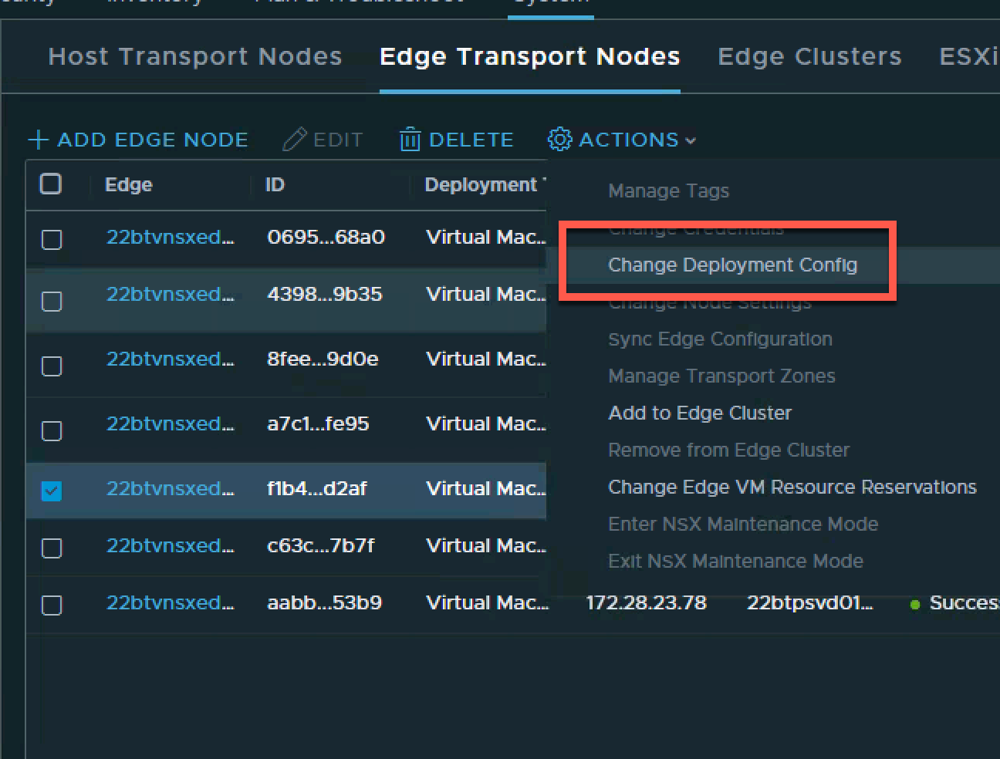

1. test

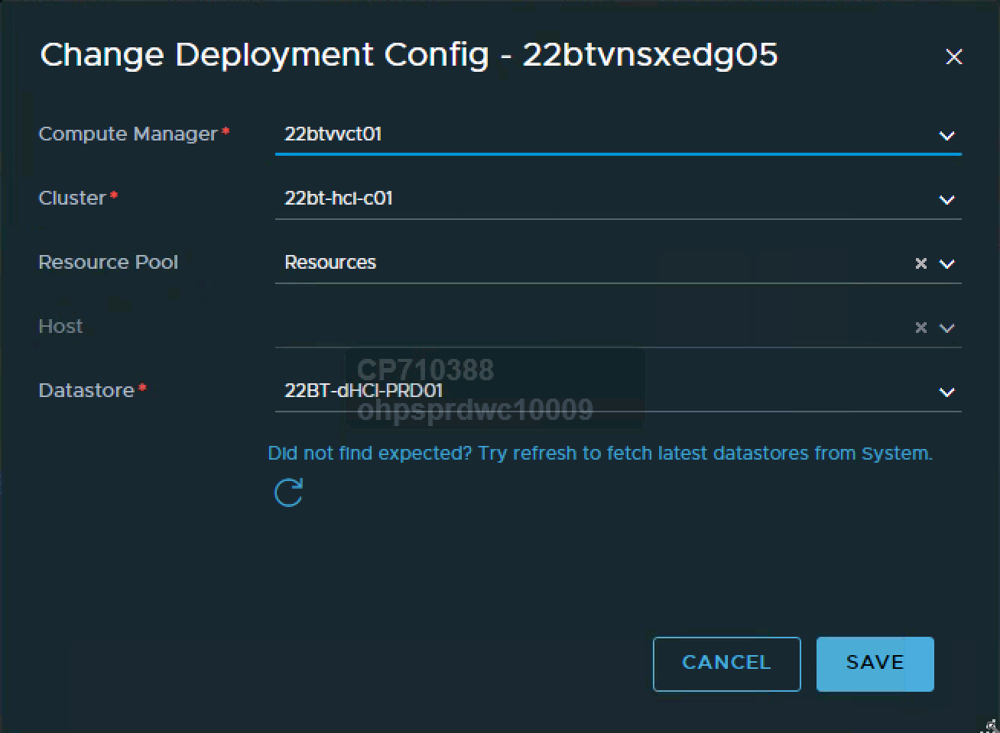

1. test

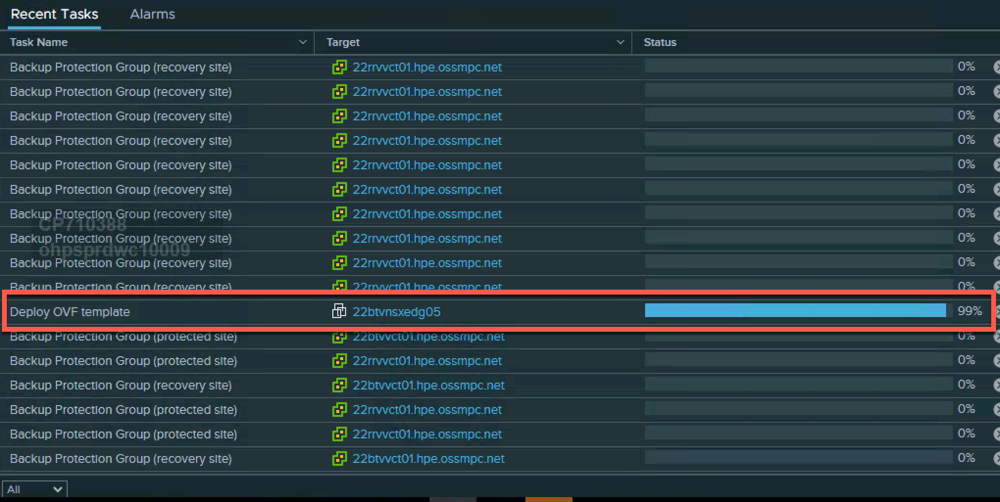

1. test

1. test

1. test

[^fn1]: *F*ully *Q*ualified *D*omain *N*ame
[^fn2]: Ensure that you have selected the correct node sizing for the workload that you are expecting, as you cannot resize an edge node, you will have to deploy a new edge node of the correct size and  [replace it](KB0007 = Replacing an Edge Node.md) 
