# KB0009 - Enable Interface Graphing on IMC

**^KB0009^**

## TLDR - Here is a video

<video src="assets/enable%20interface%20graphing%20in%20IMC.mp4"></video>

## Step-By-Step

1. Select `Resource` from the menu bar
   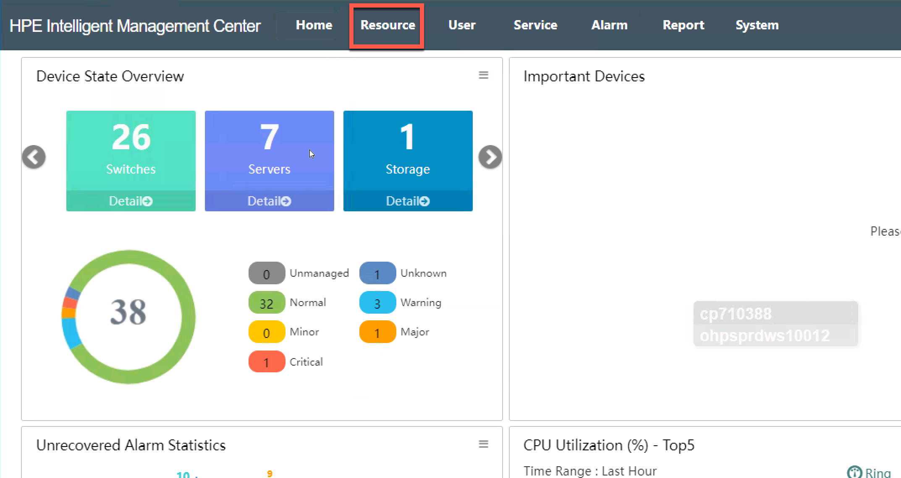
1. Select `Perfomance Monitoring`
   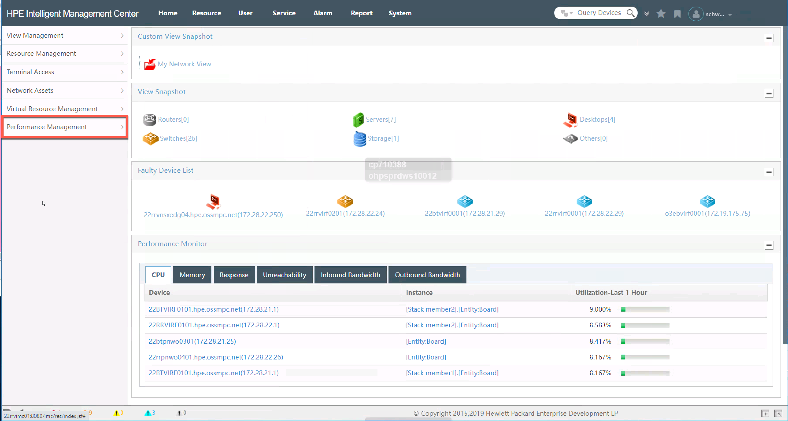
1. Select `Monitoring Settings`
   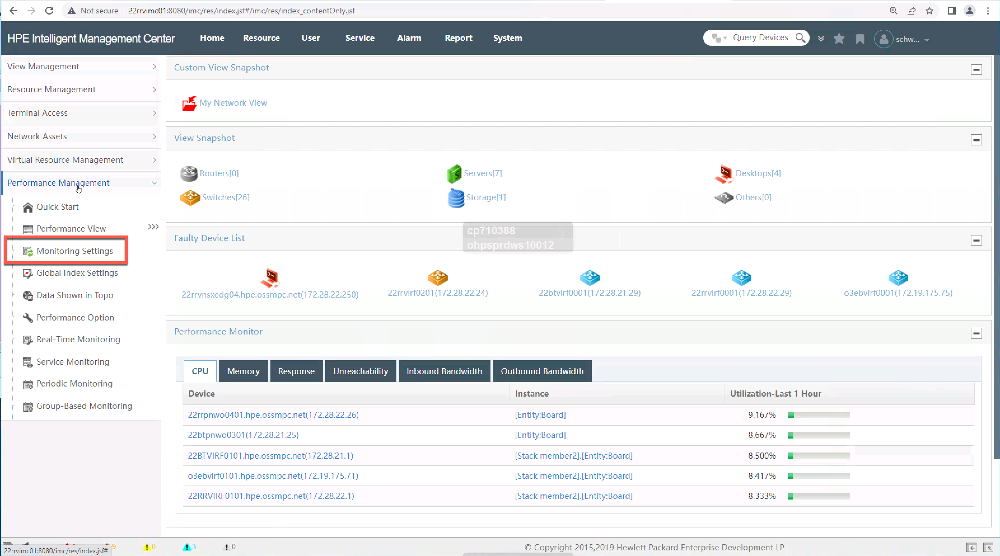
1. Click `Add Monitor`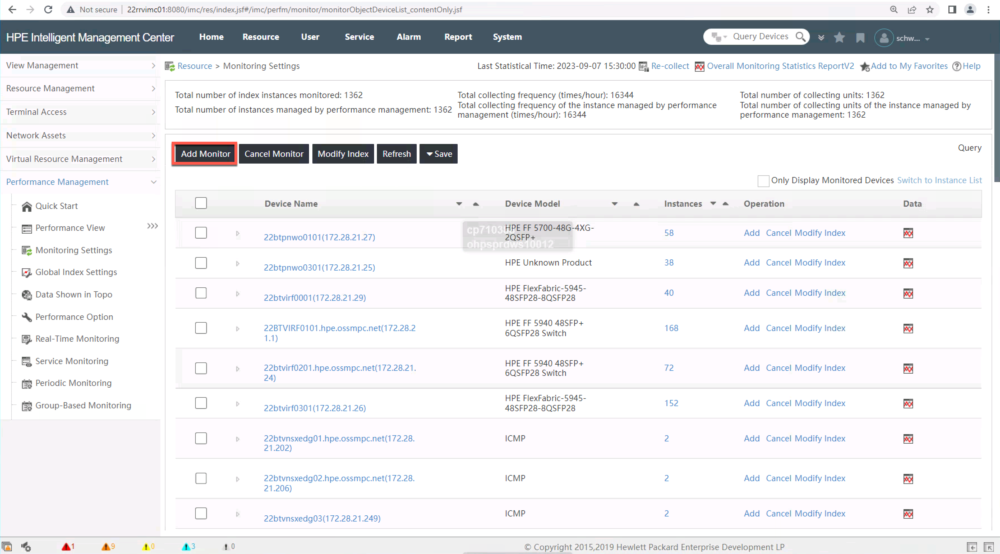
1. You will be presented with a pop up window
   * Select `Add` under Select Index
     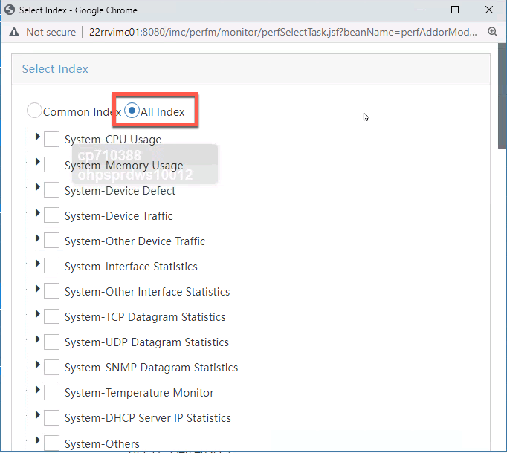
   * Expand System-Interface Statistics and select
     * Interface Receiving Rate (bps)
     * Interface Transmitting Rate (bps)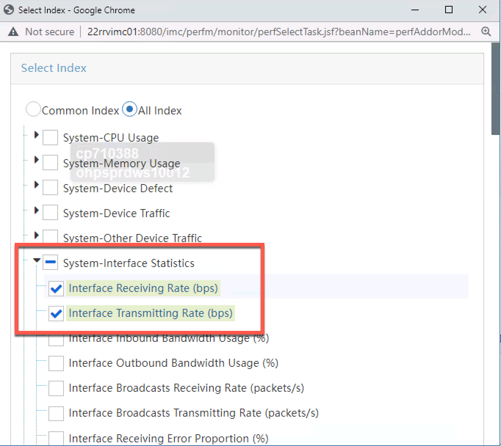
     * Scroll to the bottom of the windows and click OK
   * Select `Add` under Select Device
     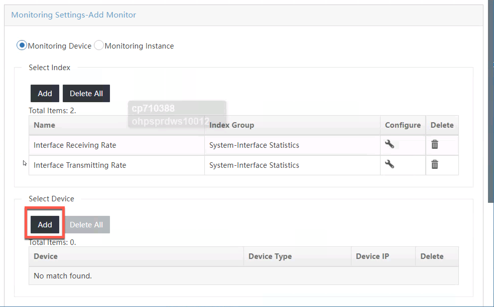
   * You will be presented with a new pop up window, click on `Device View` on the left hand tree
     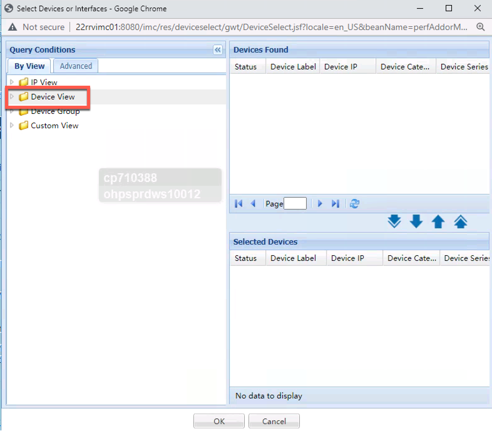
   * Select the devices you wish to monitor presented on the right
     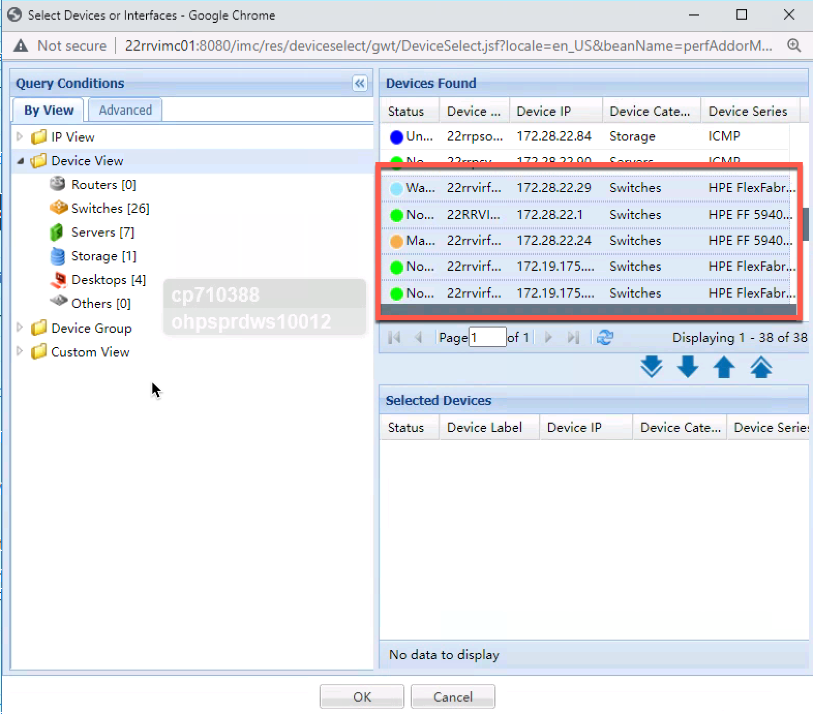
   * Click the `single down arrow` to add the devices to Selected Devices
     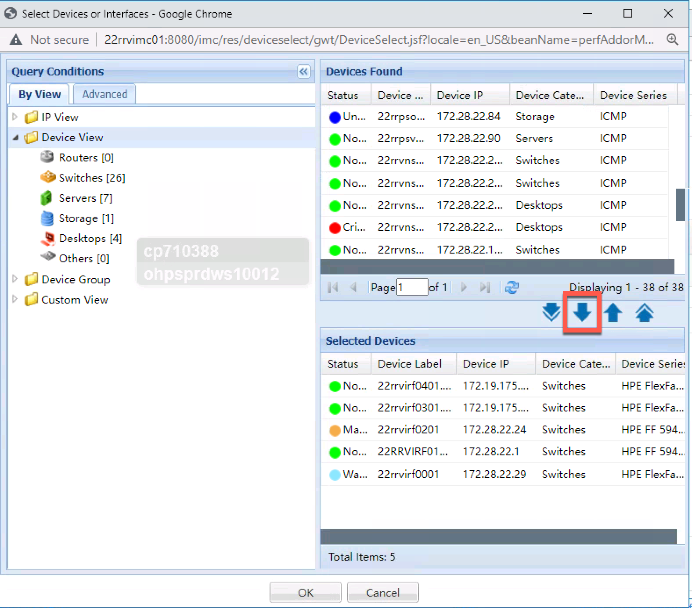
   * Scroll to the bottom of the screen and selecct `Up Physical Interfaces` and Click OK
     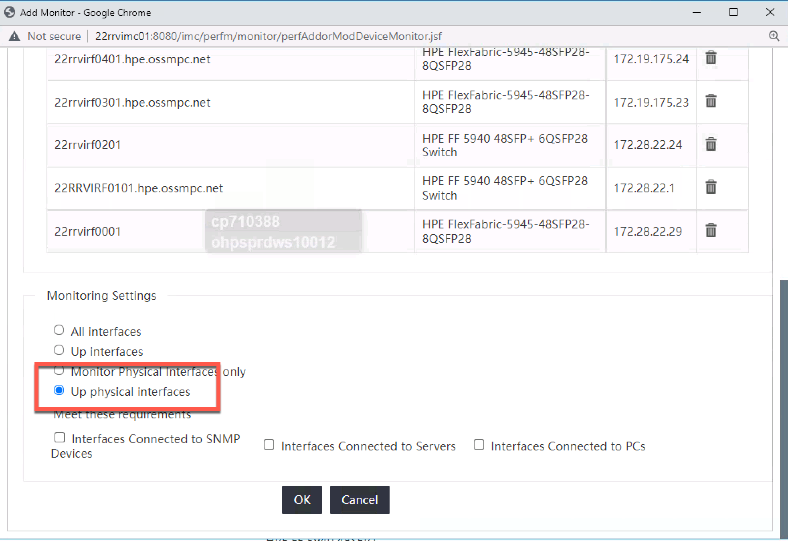
   * You will be shown the interfaces that have been added for monitoring
     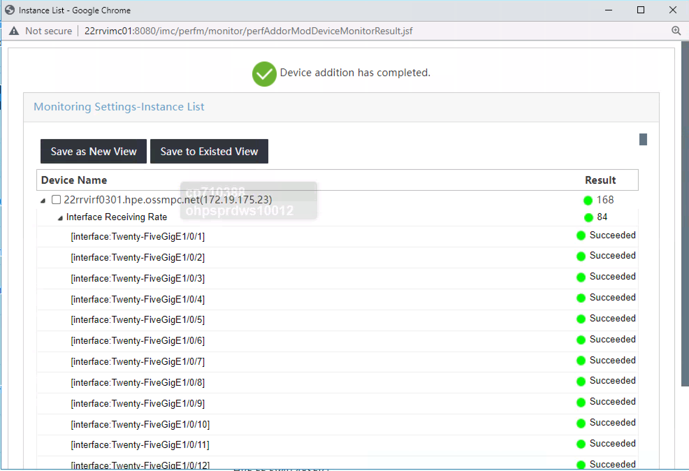

